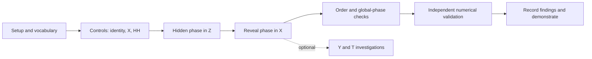

# Critical Path and Scope Decisions

## Research question

Under which measurement choices do short one-qubit gate sequences become distinguishable, and which apparent differences are only global phase?

The distinctive element is the teaching workflow: predict before revealing, compare two circuits, identify an uninformative measurement, and revise the experiment. The quantum mechanics and the idea of basis-dependent measurement are established. No claim of research novelty is made.

## Critical path

These are estimated learning/rebuild times for someone comfortable with basic Python, not recorded time spent creating this repository. Allow 5–7 focused hours, plus time to learn unfamiliar vocabulary or resolve setup issues.

| Step | Depends on | Estimated effort | Exit condition |
| --- | --- | --- | --- |
| Setup and vocabulary | None | 30–60 min | Run one CLI example; define gate, basis, and shot. |
| Controls | Setup | 45 min | Explain identity, X, and HH on 0. |
| Hidden phase and readout | Controls | 60–90 min | Predict H versus HZ in both Z and X. |
| Counterexamples | Hidden phase | 45–60 min | Explain gate order and global versus relative phase. |
| Independent check | Correct mathematical model | 45–60 min | Run tests and reference validator; inspect tolerances and scope. |
| Reproduction and explanation | Checks | 30–60 min | Save a lab note and deliver a three-minute demonstration. |

If setup is difficult, continue with `python explore.py` and the standard-library tests. If X/Z measurement is still confusing, postpone Y/T and the optional interface styling. If independent checks fail, fix the mathematical or readout convention before trusting any plot.

## Options considered

There are infinitely many gate sequences and continuous one-qubit states. “All options” here means the main practical beginner project designs, plus an exhaustive finite test grid; it cannot mean every possible quantum experiment.

| Approach | Benefit | Cost or limitation | Decision |
| --- | --- | --- | --- |
| Gate flashcards | Very easy to build | Encourages memorization; little experimental reasoning | Include concise explanations, not the main project. |
| Jupyter-only tutorial | Familiar scientific format | Cell order and environment can confuse a first run | Possible later presentation format; avoid duplicate implementations now. |
| Bloch-sphere animation | Intuitive geometry | Can become a graphics project; can hide what is actually measurable | Show exact coordinates and traces first. |
| Two-circuit comparison | A controlled change has a visible consequence | Requires explicit basis and outcome labels | Selected core. |
| Small transparent simulator | Readable mathematics; CLI has no dependencies | Must be independently checked | Selected and checked against two separate libraries. |
| SDK-only app | Less custom simulation code | Beginners encounter a larger API before learning the experiment | Use Qiskit as a reference, with a small standalone teaching core. |
| Full state tomography | Connects to experimental characterization | Density matrices, fitting, and physicality constraints add substantial scope | Compare conceptually; defer implementation. |
| Quantum hardware | Real device behavior | Accounts, scheduling, noise, and calibration complicate interpretation | Future extension after ideal behavior is understood. |
| Noise and mixed states | More realistic | A pure-state model is insufficient | Future density-matrix version, not a hidden approximation. |
| Continuous RX/RY/RZ sliders | Broader one-qubit coverage | Unbounded parameter space and more conventions | Future extension after discrete-gate checks. |

## Finite exploration grid

Six gates `{X,Y,Z,H,S,T}`, all sequence lengths 0 through 4, six cardinal starting states, and three bases:

`(1 + 6 + 36 + 216 + 1296) × 6 × 3 = 27,990 settings`.

Each setting is compared independently with Qiskit and QuTiP, for 55,980 reference probability comparisons. Sequences that happen to represent the same operation are retained; this tests different execution paths. Longer user sequences are supported up to 24 gates, but are not exhaustively covered by this grid.

## What counts as finished?

- The eight investigations run and their analytical predictions agree with the implementation.
- The central H/HZ example is understandable without advanced mathematics.
- Invalid inputs get useful errors.
- Changing an experiment hides old results until a new prediction/run.
- Every run can be saved with its seed and settings.
- Automated and reference checks are reproducible, with limitations stated.
- Documentation separates exact probabilities, sampled data, and physical hardware.

Repository publication is a separate delivery step requiring authenticated access to `devika1806`; it does not change the scientific acceptance criteria.
